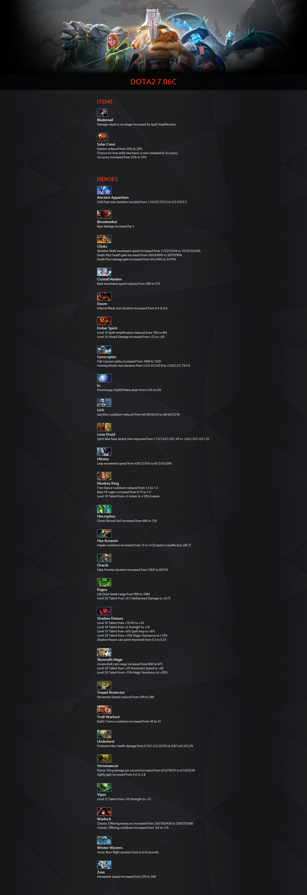
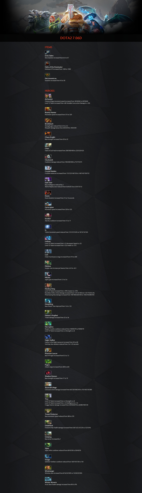

# dota2PatchScraper

 le balanced scraper widget 

A small (but continually growing) patch generator for DotA2 sub-patches.

Many thanks to Valve for their font "Radiance", the Steam API and various artworks/icons. And of course for all of their work on DotA2

## Requirements

[LXML](http://lxml.de)
[requests](http://docs.python-requests.org/en/master/)

```
pip install -r requirements.txt
```

A key to the [Steam API](http://steamcommunity.com/dev) is not required, but can be used to get updated hero and item data

## Use

The script can be imported into existing projects or called via the command line (currently under development, and not completely tested).

###### Importing in an existing project
```
from dota2ps import DOTAPatch
```

###### CLI
```
python dota2ps.py
> http://www.dota2.com/news/updates/29717

OR

python d2ps.py http://www.dota2.com/news/updates/29717
```

## Documentation

COMING SOON

## Sample Patch Notes




